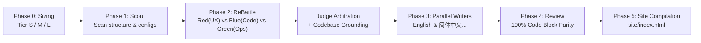

# MakeWiki.skills

<p align="center">
  <strong>Multi-Agent Technical Documentation Generator & Offline Static Wiki Compiler for AI Coding Assistants</strong>
</p>

<p align="center">
  <a href="LICENSE"></a>
  <a href="pyproject.toml"></a>
  <a href="tests/"></a>
  <a href="skills/makewiki/"></a>
  <a href="makewiki/site/"></a>
  <a href="makewiki/export/"></a>
  <a href="makewiki/sync/"></a>
</p>

---

**English** | [简体中文](README.md)

---

MakeWiki is an open-source multi-agent skill plugin and toolkit designed for AI coding assistants (such as Claude Code, Codex, and Agentic IDEs).

By combining **dynamic project sizing** with **ReBattle competitive verification**, MakeWiki autonomously generates zero-hallucination, multilingual Markdown documentation with 100% code parity, and compiles it into an offline static wiki website, PDF-ready printable guides, EPUB e-books, and Confluence / Notion knowledge base sync payloads.

---

## ⚡ Quick Start

### 1. Load the Plugin

```bash
claude --plugin-dir /path/to/MakeWiki.skills
```

### 2. Run in Conversation

```text
/makewiki --lang en --lang zh-CN
```

MakeWiki autonomously assesses project complexity, runs multi-perspective ReBattle blind audits, writes multilingual documents in parallel, and compiles structured docs, offline static sites, PDF/EPUB bundles, and knowledge base sync payloads under `<project>/makewiki/`.

---

## 🛠️ Skills & Toolkit Overview

| Skill / Command      | Description                                                                                                                                         | Usage Example                                             |
| -------------------- | --------------------------------------------------------------------------------------------------------------------------------------------------- | --------------------------------------------------------- |
| `/makewiki`          | **Full Pipeline**: Sizing $\rightarrow$ Scout $\rightarrow$ ReBattle $\rightarrow$ Parallel Writers $\rightarrow$ Review $\rightarrow$ Compile Site | `/makewiki --lang en --lang zh-CN`                        |
| `/makewiki-site`     | **Static Site Compiler**: Compile Markdown docs into an offline HTML wiki site                                                                      | `/makewiki-site ./makewiki --theme auto`                  |
| `export` command     | **Single-File Exporter**: Compile Markdown into PDF-Ready HTML and EPUB e-books                                                                     | `python scripts/run_toolkit.py export makewiki --lang en` |
| `sync` command       | **Knowledge Base Sync**: Build Confluence Storage XML and Notion Block API sync payloads                                                            | `python scripts/run_toolkit.py sync makewiki --lang en`   |
| `/makewiki-scan`     | **Project Sizing**: Inspect codebase evidence and determine complexity tier (Tier S/M/L)                                                            | `/makewiki-scan`                                          |
| `/makewiki-review`   | **Quality Review**: Cross-language consistency, code block parity, and anti-hallucination check                                                     | `/makewiki-review --lang en --lang zh-CN`                 |
| `/makewiki-validate` | **Validation**: Heading hierarchy, link integrity, and anti-AI cliché audit                                                                         | `/makewiki-validate ./makewiki`                           |
| `/makewiki-init`     | **Config Init**: Generate default `makewiki.config.yaml` template                                                                                   | `/makewiki-init`                                          |

---

## 📁 Output Structure

Documents and static site are generated under `<project>/makewiki/`:

```text
makewiki/
├── index.md                         # Navigation map & language index
├── README.md / README.zh-CN.md      # Project overview
├── getting-started.md / ...         # 5-minute quickstart (Tutorial)
├── installation.md / ...            # Installation & compatibility matrix (Runbook)
├── configuration.md / ...           # Configuration & environment variables (Matrix)
├── usage/
│   ├── overview.md                  # Feature map & module dependencies (Explanation)
│   └── <module>.md                  # Task-oriented workflows (How-To)
├── faq.md / ...                     # FAQs & known constraints
├── troubleshooting.md / ...         # Symptom-to-resolution runbook (Incident Runbook)
└── site/
    └── index.html                   # Offline single-page static Wiki (double-click to open)
```

---

## 💡 Architecture & Design



- **Dynamic Budgeting**: The orchestrator assesses complexity (Tier S: 1-2 agents, Tier M: 3-5 agents, Tier L: 5-10 agents max) to prevent token explosion.
- **ReBattle Competitive Verification**: Agent Red (UX/Tutorial), Agent Blue (Source/AST), and Agent Green (Ops/Deployment) blind-audit and cross-examine claims to eliminate hallucinations.
- **Independent Multilingual Generation**: Each language is generated directly from the semantic model (never machine-translated); code blocks remain 100% identical.
- **Natural Engineering Prose**: Strict ban on binary tropes (*"not X, but rather Y"*), abstract buzzwords (*"convergence"*), and redundant trailing colons.
- **Zero-Dependency Static Site**: Embedded single-file HTML/CSS/JS with search, dark/light theme, and multilingual switcher without requiring Node.js or local web servers.
- **Zero Environment Pollution**: Internal tools run in isolated environments and clean up immediately.

---

## ⚙️ Configuration (`makewiki.config.yaml`)

Optional configuration file in the project root:

```yaml
output_dir: makewiki
languages:
  - en
  - zh-CN
default_language: en
overwrite: true

agent:
  max_subagents: 10          # Subagent budget cap
  rebattle_rounds: 2         # Debate rounds
  tier_override: auto        # auto | S | M | L

site:
  compile: true              # Automatically compile static site
  theme: auto                # auto | light | dark
  include_search: true       # Client-side instant search

delivery:
  audience: dual             # dual | end-user | enterprise
  include_deployment_runbook: true
  include_compatibility_matrix: true
```

---

## 💻 Local Development & Testing

MakeWiki.skills requires Python 3.11+ and uses `uv`:

```bash
# Clone repository and install dependencies
git clone https://github.com/somnifex/MakeWiki.skills.git
cd MakeWiki.skills
uv sync --all-extras

# Run test suite
uv run pytest --basetemp=.pytest_temp

# Type checking and linting
uv run mypy src/makewiki_skills
uv run ruff check .
```

---

## 📄 License

Licensed under the [MIT License](LICENSE).
