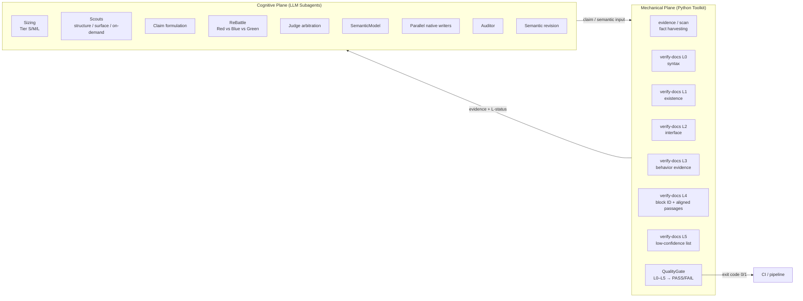

# MakeWiki.skills


<p align="center">
  <strong>LLM-first, Evidence-backed, Multi-Agent Documentation Compiler for AI Coding Assistants</strong>
</p>

<p align="center">
  <a href="LICENSE"></a>
  <a href="pyproject.toml"></a>
  <a href="tests/"></a>
  <a href="SKILL.md"></a>
  <a href="references/grounding_policy.md"></a>
  <a href="SKILL.md"></a>
  <a href="subskills/site/"></a>
  <a href="subskills/export/"></a>
  <a href="subskills/sync/"></a>
</p>

---

**English** | [简体中文](README.md)

---

MakeWiki is an open-source multi-agent skill plugin and Python toolkit designed for AI coding assistants (Claude Code, Codex, agentic IDEs). It follows an **LLM-first architecture**: LLM subagents own all comprehension, reasoning, and writing; the Python toolkit only proves what can be mechanically proven. The result is **evidence-backed**, multilingual Markdown documentation, compiled into an offline static wiki, HTML print guides, EPUB e-books, and Confluence / Notion sync payloads.

> **Cognitive Authority Boundary**: the LLM decides what the repository means; Python only proves what can be proven mechanically. When it cannot prove something, Python returns `UNKNOWN` — it never guesses.

---

## ⚡ Quick Start

### 1. Load the Plugin

```bash
claude --plugin-dir /path/to/MakeWiki.skills
```

### 2. Run in Conversation

```text
/makewiki --lang en --lang zh-CN
```

The orchestrator runs the authoritative pipeline — Sizing → Scout → ReBattle → Judge → Semantic Model → Parallel Writers → Auditor → Semantic Revision — and consults the Python toolkit for evidence extraction, L0–L5 verification, and the Quality Gate. Output lands under `<project>/makewiki/`.

---

## 🛠️ Skills & CLI Surface

The CLI surface is designed around authoritative names with backward-compatible aliases. The Python side is strictly mechanical; cognition lives in the LLM plane.

| Plane                           | Authority                              | Aliases             | Role                                                                 |
| ------------------------------- | -------------------------------------- | ------------------- | -------------------------------------------------------------------- |
| Full Skill                      | `/makewiki`                            | —                   | Full pipeline: Sizing → Scout → ReBattle → Writer → Review → Compile |
| Site                            | `/makewiki-site`                       | —                   | Compile Markdown into offline static Wiki                            |
| Validation                      | `/makewiki-validate`                   | —                   | Markdown structure & link integrity                                  |
| Quality Review                  | `/makewiki-review`                     | `semantic-review`   | Extract cross-language alignments + behavior evidence                |
| Project Sizing                  | `/makewiki-scan`                       | —                   | Tier assessment + fact extraction (calls `evidence`)                 |
| Config Init                     | `/makewiki-init`                       | —                   | Generate default `makewiki.config.yaml`                              |
| Toolkit: Sizing                 | `makewiki sizing <path>`               | —                   | Tier S/M/L classification                                            |
| Toolkit: Evidence               | `makewiki evidence <path>`             | `makewiki scan`     | Fact JSON (no interpretation)                                        |
| Toolkit: Verify                 | `makewiki verify-docs <path>`          | `makewiki verify`   | L0–L5 + QualityGate → PASS/FAIL + CI exit code                       |
| Toolkit: Claim verify           | `makewiki verify-claim <claim.json>`   | —                   | Per-claim L-status                                                   |
| Toolkit: Model verify           | `makewiki verify-model <model.json>`   | —                   | SemanticModel schema + evidence-ref validation                       |
| Toolkit: Parity                 | `makewiki parity <path>`               | —                   | Block-ID exact match + aligned passages                              |
| Toolkit: ReBattle diff          | `makewiki rebattle-diff`               | —                   | Deterministic dispute organizer                                      |
| Toolkit: Site                   | `makewiki build-site <path>`           | —                   | Compile offline static site                                          |
| Toolkit: Export                 | `makewiki export <path> --format html\ | epub\               | all`                                                                 | — | Single-file export (rejects `pdf`) |
| Toolkit: Sync bundle            | `makewiki sync-bundle <path>`          | `makewiki sync`     | Prepare Confluence/Notion bundles (no publish)                       |
| Toolkit: Deterministic scaffold | `makewiki legacy-generate <path>`      | `makewiki generate` | **Non-authoritative**, regression only                               |
| Toolkit: Config init            | `makewiki init-config`                 | —                   | Generate default `makewiki.config.yaml`                              |

---

## 📁 Output Structure

Documents and static site land under `<project>/makewiki/`:

```text
makewiki/
├── index.md                         # Navigation map & language index
├── README.md / README.zh-CN.md      # Project overview
├── getting-started.md / ...         # 5-minute quickstart (Tutorial)
├── installation.md / ...            # Installation & compatibility matrix (Runbook)
├── configuration.md / ...           # Configuration & environment variables (Matrix)
├── usage/
│   ├── overview.md                  # Feature map & module dependencies (Explanation)
│   └── <module>.md                  # Task-oriented workflows (How-To)
├── faq.md / ...                     # FAQs (LLM-injected; UNKNOWN if absent)
├── troubleshooting.md / ...         # Symptom-to-resolution runbook (Incident Runbook)
└── site/
    └── index.html                   # Offline single-page static Wiki (double-click to open)
```

---

## 💡 Two-Plane Architecture & Authority Boundary

MakeWiki v2 splits cleanly into two planes and codifies a **Cognitive Authority Boundary**:



- **Cognitive Plane**: LLM subagents own all comprehension, reasoning, debate, writing, and auditing. Host capabilities select parallel / sequential / main-agent fallback.
- **Mechanical Plane**: Python only proves what can be proven — fact harvesting, AST/CLI/config parsing, L0/L1/L2, exact-match block parity via stable block IDs, `UNKNOWN` fallbacks, and Quality Gate aggregation.
- **Cognitive Authority Boundary**: when Python cannot prove something, it returns `UNKNOWN`. It never invents `faq`, `troubleshooting`, `usage_examples`, `user_tasks`, or `platform_notes` — those fields are LLM-injected.
- **Host Capability fallback**: when the host has no subagent API, the main agent takes each role in sequence; when parallelism is unavailable, it degrades to sequential execution. "No subagent API" never means "MakeWiki cannot run."

---

## ✅ Grounding: Evidence-Backed with Layered Verification

MakeWiki no longer claims "zero hallucinations." It delivers **verifiable, evidence-backed documentation** through layered automated checks:

- **L0 Syntax** — Markdown AST, single H1, heading hierarchy, internal link integrity.
- **L1 Existence** — every referenced file path, executable command, and config key exists in the repository.
- **L2 Interface** — CLI argument names, flags, defaults, env vars, and type constraints match source declarations.
- **L3 Behavior** — exit codes, error conditions, log paths, and execution flows trace to source handlers (Python supplies evidence, LLM judges).
- **L4 Cross-language** — stable block IDs (`getting_started.install`, etc.) and stable H2 section markers (`<!-- makewiki:section=<slug> -->`) enable exact-match parity (L4a mechanical) plus aligned-passage output for LLM prose auditing (L4b semantic). Cross-language matching is always keyed on stable block/section IDs, never on heading text or heading position; section ORDER may differ per language.
- **L5 Epistemic** — low-confidence and ungrounded commands are surfaced by Python; the LLM auditor reasons over them. The audit conclusions are persisted as a `SemanticAuditBundle` JSON, consumed by `verify-docs --semantic-audit <file>` (a flag on the `verify-docs` command); Python only validates schema and digests and never re-judges the verdicts, and a bundle is rejected as stale if the documents change.
- **Quality Gate** — a single `verify-docs` run aggregates L0–L5 into a `QualityGateResult` (PASS/FAIL + Grounding Score + unresolved critical count) and returns a CI exit code.

`zero-hallucination` is not an engineering promise. **Grounding Score, unresolved critical counts, and L0–L5 status** are. See [`references/grounding_policy.md`](references/grounding_policy.md).

---

## ⚙️ Configuration (`makewiki.config.yaml`)

Optional config file at the project root. Fields fall into four classes:

- **LLM-only** — read by the Skill orchestrator / writers (`agent.*`, `delivery.*`, `content_depth.*`, `language_profiles.*`, and the other `documentation_policy.*` fields besides the two Shared ones below).
- **Python-only** — read by the mechanical plane (`site.*`, `scan.*`, `review.*`, `quality.*`, `revision.*`, etc.).
- **Shared** — read by Python for mechanical enforcement AND by the LLM writer as guidance (`documentation_policy.forbid_unfounded_praise` and `documentation_policy.banned_descriptors`).
- **Legacy-only** — empty today (the deprecated `legacy-generate` path has no live config surface).

```yaml
output_dir: makewiki
languages:
  - en
  - zh-CN
default_language: en
overwrite: true

agent:                       # LLM-consumed
  max_subagents: 10
  rebattle_rounds: 2
  tier_override: auto

site:                        # Python-consumed
  compile: true
  theme: auto
  include_search: true

delivery:                    # LLM-consumed
  audience: dual
  include_deployment_runbook: true
  include_compatibility_matrix: true

quality:                     # Quality Gate thresholds
  fail_on_critical: true
  min_grounding_score: 1.0
```

Field classifications live in the config schema and are enforced by `tests/contracts/test_config_consumption_contract.py`.

---

## 💻 Local Development & Testing

MakeWiki.skills requires Python 3.11+ and uses `uv`:

```bash
# Clone repository and install dependencies
git clone https://github.com/somnifex/MakeWiki.skills.git
cd MakeWiki.skills
uv sync --all-extras

# Run automated test suite (includes contract tests)
uv run pytest --basetemp=.pytest_temp

# Type checking and linting
uv run mypy src/makewiki_skills
uv run ruff check .
```

The toolkit exposes a `makewiki` console entry on install. The `/makewiki` Skill pulls a matching Toolkit release through a version-pinned + SHA256-verified bootstrap script, keeping Skill and Toolkit versions aligned.

---

## 📄 License

Licensed under the [MIT License](LICENSE).
