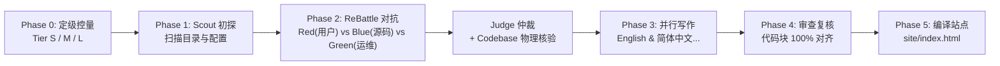

# MakeWiki.skills

<p align="center">
  <strong>面向 AI Coding Assistant 的多智能体技术文档生成与离线静态 Wiki 编译引擎</strong>
</p>

<p align="center">
  <a href="LICENSE"></a>
  <a href="pyproject.toml"></a>
  <a href="tests/"></a>
  <a href="skills/makewiki/"></a>
  <a href="makewiki/site/"></a>
  <a href="makewiki/export/"></a>
  <a href="makewiki/sync/"></a>
</p>

---

[English](README.en.md) | **简体中文**

---

MakeWiki 是一个开源的多智能体技能插件与文档生成工具包，专为 Claude Code、Codex 等 AI 编程助手设计。

它通过**项目复杂度定级**与 **ReBattle 竞争对抗验证**，为软件项目自动生成无幻觉、代码块 100% 一致的多语言 Markdown 技术文档，并一键编译为开箱即用的离线单页静态 Wiki 网站、PDF-Ready 打印指南、EPUB 电子书与 Confluence / Notion 知识库同步载荷。

---

## ⚡ 快速使用

### 1. 载入插件

```bash
claude --plugin-dir /path/to/MakeWiki.skills
```

### 2. 在对话中调用

```text
/makewiki --lang en --lang zh-CN
```

MakeWiki 会自动测绘代码规模、启动多角色对抗盲审、并行撰写各语言文档，并在 `<项目>/makewiki/` 输出结构化文档、静态站点、PDF/EPUB 导出包与知识库同步数据。

---

## 🛠️ Skills 技能与工具列表

| Skill / 命令 | 说明 | 用法示例 |
| :--- | :--- | :--- |
| `/makewiki` | **完整流水线**：自动定级 $\rightarrow$ Scout 初探 $\rightarrow$ ReBattle 对抗 $\rightarrow$ 并行写作 $\rightarrow$ 审查 $\rightarrow$ 编译站点 | `/makewiki --lang en --lang zh-CN` |
| `/makewiki-site` | **静态站点编译**：将已有的 Markdown 文档编译为离线 HTML Wiki 站点 | `/makewiki-site ./makewiki --theme auto` |
| `export` 命令 | **单文件导出**：将 Markdown 编译为 PDF-Ready 打印 HTML 与 EPUB 电子书 | `python scripts/run_toolkit.py export makewiki --lang zh-CN` |
| `sync` 命令 | **知识库同步**：构建 Confluence Storage XML 与 Notion Block API 同步载荷 | `python scripts/run_toolkit.py sync makewiki --lang zh-CN` |
| `/makewiki-scan` | **代码测绘**：评估项目规模（Tier S/M/L）并提取代码事实简报 | `/makewiki-scan` |
| `/makewiki-review` | **质量复核**：检查跨语言代码块对齐度、事实准确性与去 AI 腔规范 | `/makewiki-review --lang en --lang zh-CN` |
| `/makewiki-validate` | **格式校验**：检查 Markdown 标题层级与内部死链 | `/makewiki-validate ./makewiki` |
| `/makewiki-init` | **配置生成**：在项目根目录生成 `makewiki.config.yaml` 模版 | `/makewiki-init` |

---

## 📁 文档与站点输出

默认生成在 `<项目>/makewiki/` 目录下：

```text
makewiki/
├── index.md                         # 目录索引与语言导航
├── README.md / README.zh-CN.md      # 项目总览
├── getting-started.md / ...         # 5 分钟上手教程 (Tutorial)
├── installation.md / ...            # 安装部署手册与兼容矩阵 (Runbook)
├── configuration.md / ...           # 配置与环境变量全量表 (Matrix)
├── usage/
│   ├── overview.md                  # 功能全景与模块依赖 (Explanation)
│   └── <module>.md                  # 场景化操作指南 (How-To)
├── faq.md / ...                     # 常见问题与已知限制
├── troubleshooting.md / ...         # 故障排查与应急指南 (Incident Runbook)
└── site/
    └── index.html                   # 离线单页静态 Wiki 网站（双击即可在浏览器中打开）
```

---

## 💡 核心设计与工作流



- **定级控量（Dynamic Budgeting）**：主代理先研判项目复杂度（Tier S: 1~2 子代理, Tier M: 3~5 子代理, Tier L: 5~10 子代理上限），按需派发，杜绝 Token 浪费。
- **ReBattle 竞争对抗验证**：由 Agent Red（交互/教程）、Agent Blue（源码/AST）、Agent Green（运维/部署）三个独立偏置的子代理进行盲审提取与交叉挑刺质询，消灭单代理事实幻觉。
- **独立母语写作**：各语言版本基于统一语义模型独立撰写，不搞机械翻译；所有命令与代码块在各语言间保持 100% 绝对一致。
- **自然工程师文风**：严格禁止“不是……而是……”、“收敛”、“这是……”等 AI 模板套话与过度冒号，动词先行。
- **零依赖离线站点**：纯单文件 HTML/CSS/JS 架构，内置多语言切换、深浅色模式、离线全文搜索与代码一键复制。
- **环境零污染**：内部工具在隔离环境中运行且用后即清，不向目标代码仓写入多余临时文件。

---

## ⚙️ 配置文件 (`makewiki.config.yaml`)

如需自定义生成行为，可在项目根目录放置配置文件（可选）：

```yaml
output_dir: makewiki
languages:
  - en
  - zh-CN
default_language: en
overwrite: true

agent:
  max_subagents: 10          # 子代理并发上限
  rebattle_rounds: 2         # 对抗质询轮数
  tier_override: auto        # auto | S | M | L

site:
  compile: true              # 生成文档后自动编译静态站点
  theme: auto                # auto | light | dark
  include_search: true       # 启用离线全文搜索

delivery:
  audience: dual             # dual (开发者+交付) | end-user | enterprise
  include_deployment_runbook: true
  include_compatibility_matrix: true
```

---

## 💻 本地开发与测试

MakeWiki.skills 基于 Python 3.11+ 构建，推荐使用 `uv` 管理开发环境：

```bash
# 克隆仓库并安装依赖
git clone https://github.com/somnifex/MakeWiki.skills.git
cd MakeWiki.skills
uv sync --all-extras

# 运行自动化测试套件
uv run pytest --basetemp=.pytest_temp

# 类型检查与代码格式化
uv run mypy src/makewiki_skills
uv run ruff check .
```

---

## 📄 开源协议

本项目采用 [MIT License](LICENSE) 协议开源。
