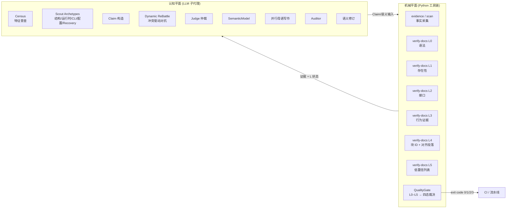

# MakeWiki.skills


<p align="center">
  <strong>面向 AI Coding Assistant 的 LLM-first、证据驱动、多智能体文档编译器</strong>
</p>

<p align="center">
  <a href="LICENSE"></a>
  <a href="pyproject.toml"></a>
  <a href="SKILL.md"></a>
  <a href="references/grounding_policy.md"></a>
  <a href="SKILL.md"></a>
  <a href="subskills/site/"></a>
  <a href="subskills/export/"></a>
  <a href="subskills/sync/"></a>
</p>

---

[English](README.en.md) | **简体中文**

---

MakeWiki 是一个开源的多智能体技能插件与 Python 工具包，专为 Claude Code、Codex 等 AI 编程助手设计。它采用 **LLM-first 架构**——LLM 子代理负责理解、推理与写作，Python 工具链做确定性的证据提取与验证——为软件项目自动生成**证据驱动（evidence-backed）**的多语言 Markdown 技术文档，并一键编译为离线单页静态 Wiki、HTML 打印指南、EPUB 电子书与 Confluence / Notion 同步载荷。文档里的每一条事实都可追溯到仓库源码，可被 L0–L5 分层验证与四态质量门禁背书，而非不可验证的"AI 臆测"。

> **Cognitive Authority Boundary**：LLM 决定仓库的含义，Python 只证明能被机械证明的东西；当无法证明时，Python 返回 `UNKNOWN`，绝不猜测。

---

## 📖 目录

- [为什么用 MakeWiki](#-为什么用-makewiki)
- [快速使用](#-快速使用)
- [Skills 技能与 CLI 工具表面](#-skills-技能与-cli-工具表面)
- [文档与站点输出](#-文档与站点输出)
- [双平面架构与权威边界](#-双平面架构与权威边界)
- [接地策略：证据驱动 + 分层自动验证](#-接地策略证据驱动--分层自动验证)
- [配置文件](#-配置文件-makewikiconfigyaml)
- [本地开发与测试](#-本地开发与测试)

---

## ✨ 为什么用 MakeWiki

普通 AI 文档工具生成的 README "看起来对"，但**无法证明对**：引用了不存在的命令、过期的配置键、夸大的形容词——用户照着做就翻车。MakeWiki 把"AI 写文档"从**黑盒生成**变成**可审计的工程流程**：

| 痛点                          | MakeWiki 的做法                                                          |
| ---------------------------- | --------------------------------------------------------------------- |
| **文档不可验证**                 | 每条事实都是可追溯到源码的 Claim，由 Python 机械证明；无法证明就返回 `UNKNOWN`，绝不编造        |
| **AI 臆测 / 幻觉**              | L0–L5 分层验证 + 四态质量门禁（`passed`/`pending_*`/`failed`）给出诚实裁决，而不是假装完美     |
| **命令 / 配置过期**              | L2 接口层核对 CLI 参数、配置键、环境变量与源码声明一致；代码变了文档就会亮红灯                    |
| **多语言不同步**                 | 用稳定块 ID 做跨语言 100% 码块对齐，各语言独立母语写作，绝不机翻                              |
| **写出来没人看**                 | 按 Diátaxis 方法论组织（Tutorial / How-To / Reference / Explanation），面向真实用户旅程   |
| **单点消费**                    | 一套 Markdown 打包输出：静态 Wiki、HTML、EPUB、Confluence / Notion 同步载荷                |

核心原则一句话：**LLM 负责"懂"，Python 负责"证"，质量门禁负责"把关"** —— 三层各司其职，边界清晰。

---

## ⚡ 快速使用

### 1. 载入插件

```bash
claude --plugin-dir /path/to/MakeWiki.skills
```

### 2. 在对话中调用

```text
/makewiki --lang en --lang zh-CN
```

主代理会按 Census → Scout → ReBattle → Judge → Semantic Model → 并行写作 → 审计 → 语义修订 的**权威流程**调度 LLM 子代理，由 Python 工具链提供证据提取、L0–L5 验证与质量门禁；最终在 `<项目>/makewiki/` 输出结构化文档、静态站点、HTML/EPUB 导出包与同步数据。

---

## 🛠️ Skills 技能与 CLI 工具表面

CLI 表面按权威名 + 向后兼容别名设计，Python 部分严格只做机械证明，不参与认知生成。

| 类别                   | 权威命令                                     | 别名                  | 平面      | 角色                                                          |
| -------------------- | ---------------------------------------- | ------------------- | ------- | ----------------------------------------------------------- |
| 全流程 Skill            | `/makewiki`                              | —                   | 认知      | 完整流水线：Census → Scout → ReBattle → Writer → Review → Compile |
| 站点编译                 | `/makewiki-site`                         | —                   | 机械      | 将既有 Markdown 编译为离线静态 Wiki                                   |
| 文档质量门禁               | `/makewiki-validate`                     | —                   | 机械      | Markdown 结构与死链校验                                            |
| 文档质量复核               | `/makewiki-review`                       | `semantic-review`   | 机械      | 提取跨语言对齐段落 + 行为证据                                            |
| 项目测绘                 | `/makewiki-scan`                         | —                   | 认知 + 机械 | 提取代码库特征普查与事实（调用 `census` 与 `evidence`）               |
| 配置生成                 | `/makewiki-init`                         | —                   | —       | 生成默认 `makewiki.config.yaml`                                 |
| Toolkit: 事实普查        | `makewiki census <path>`                 | `makewiki sizing`   | 机械      | 提取代码库原始事实（文件数、语言、清单、入口、单体/多包等）                 |
| Toolkit: 证据          | `makewiki evidence <path>`               | `makewiki scan`     | 机械      | 输出事实 JSON（不解读）                                              |
| Toolkit: 覆盖率         | `makewiki coverage <path>`               | —                   | 机械      | 机械覆盖报告：发现/扫描/跳过/忽略、未覆盖类别、低置信度事实                               |
| Toolkit: 验证          | `makewiki verify-docs <path>`            | `makewiki verify`   | 机械      | L0–L5 + QualityGate → 四态裁决（passed / pending_semantic_review / pending_mechanical_verification / failed）+ CI exit code |
| Toolkit: 声明验证        | `makewiki verify-claim <claim.json>`     | —                   | 机械      | 单条/多条 Claim 的 L 状态                                          |
| Toolkit: 模型验证        | `makewiki verify-model <model.json>`     | —                   | 机械      | SemanticModel schema + 证据引用校验                               |
| Toolkit: 跨语言对比       | `makewiki parity <path>`                 | —                   | 机械      | 块 ID 完全相同 + 对齐段落输出                                          |
| Toolkit: ReBattle 差异 | `makewiki rebattle-diff`                 | —                   | 机械      | 争议点确定性组织                                                    |
| Toolkit: 站点          | `makewiki build-site <path>`             | —                   | 机械      | 编译离线静态站点                                                    |
| Toolkit: 导出          | `makewiki export <path> --format html\|epub\|all` | — | 机械 | 单文件导出（拒绝 `pdf`） |
| Toolkit: 同步载荷        | `makewiki sync-bundle <path>`            | `makewiki sync`     | 机械      | 仅准备 Confluence/Notion 同步包，不发布                               |
| Toolkit: 配置生成        | `makewiki init-config`                   | —                   | —       | 生成默认 `makewiki.config.yaml`                                 |

---

## 📁 文档与站点输出

默认生成在 `<项目>/makewiki/` 目录下：

```text
makewiki/
├── index.md                         # 目录索引与语言导航
├── README.md / README.zh-CN.md      # 项目总览
├── getting-started.md / ...         # 5 分钟上手教程 (Tutorial)
├── installation.md / ...            # 安装部署手册与兼容矩阵 (Runbook)
├── configuration.md / ...           # 配置与环境变量全量表 (Matrix)
├── usage/
│   ├── overview.md                  # 功能全景与模块依赖 (Explanation)
│   └── <module>.md                  # 场景化操作指南 (How-To)
├── faq.md / ...                     # 常见问题与已知限制（LLM 注入，缺失则标 UNKNOWN）
├── troubleshooting.md / ...         # 故障排查与应急指南 (Incident Runbook)
└── site/
    └── index.html                   # 离线单页静态 Wiki 网站（双击即可在浏览器中打开）
```

---

## 💡 双平面架构与权威边界

MakeWiki v2 显式划分为两个平面，并定义**认知权威边界**：



- **认知平面（Cognitive Plane）**：由 LLM 子代理承担所有理解、推理、对抗、写作与审计；可借助 Host Capability 选择并行 / 串行 / 主代理降级策略。
- **机械平面（Mechanical Plane）**：Python 工具链只做能机械证明的事情——事实普查、事实提取、AST/CLI/配置解析、L0/L1/L2、L4 块 ID 完全相同比较、`UNKNOWN` 兜底、Quality Gate 汇总。
- **认知权威边界（Cognitive Authority Boundary）**：Python 是可审计证据通道，而非绝对权威。当 Python 证据与源码直接阅读冲突时，主代理必须深入调查；机械工具失败时进入降级状态（`pending_mechanical_verification`），绝不导致认知流程终止，主代理可启动 Recovery Scout 开展代码直读。
- **Host Capability fallback**：当宿主不支持子代理时，主代理按顺序承担各角色；当不支持并行时降级为串行；不存在"没有子代理 API 就不能跑 MakeWiki"的情况。

---

## ✅ 接地策略：证据驱动 + 分层自动验证

MakeWiki 不再宣称"零幻觉"，而提供**可验证的证据驱动文档**：

- **L0 语法**：Markdown AST、单 H1、标题层级、内部链接有效性。
- **L1 存在性**：所有引用的文件路径、可执行命令、配置键在仓库中存在。
- **L2 接口**：CLI 参数名、标志、默认值、环境变量名、类型约束与源码声明一致。
- **L3 行为**：退出码、错误条件、日志位置、执行流可追溯到源码处理器（Python 提供行为证据，LLM 判定）。
- **L4 跨语言**：通过稳定块 ID（`getting_started.install` 等）与稳定 H2 节标记（`<!-- makewiki:section=<slug> -->`）做完全相同比对（L4a 机械），再输出对齐段落供 LLM 散文审计（L4b 语义）。跨语言比对始终按稳定块/节 ID 匹配，绝不按标题文本或标题位置；各语言小节顺序可不同。
- **L5 认识论**：所有低置信 / 未接地命令由 Python 列出，LLM 审计做最终判断；审计结论以 `SemanticAuditBundle` JSON 持久化，由 `verify-docs --semantic-audit <file>`（`verify-docs` 上的一个标志）消费，Python 只校验 schema 与摘要、绝不复判语义，文档变更后旧 bundle 判为过期需重新审计。
- **Quality Gate**：单次 `verify-docs` 调用汇总 L0–L5 → `QualityGateResult`，输出诚实的**四态裁决** `passed` / `pending_semantic_review` / `pending_mechanical_verification` / `failed`（附 Grounding Score、机械分数、未解决关键/主要/次要问题计数与每层状态），并把裁决映射为 CI exit code（`passed`→0、`failed`→1、`pending_semantic_review`→0（`allow_pending_llm_layers` 为 true）或 2、`pending_mechanical_verification`→3）。

`zero-hallucination` 不是工程承诺；**Grounding Score、未解决关键问题数、L0–L5 状态** 才是。详见 [`references/grounding_policy.md`](references/grounding_policy.md)。

---

## ⚙️ 配置文件 (`makewiki.config.yaml`)

如需自定义生成行为，可在项目根目录放置配置文件（可选）。配置字段分为三类：

- **LLM-only**：被 Skill 编排器 / 写作者读取（`agent.*`、`delivery.*`、`content_depth.*`、`language_profiles.*` 及全部 `documentation_policy.*`）。
- **Python-only**：被权威机械 CLI 读取（`scan.*`、`review.*`（仅 `enable_review_pair_generation` 与 `min_page_alignment_ratio`）、`quality.*`、`output_dir`、`languages`、`default_language`）。
- **Shared**：当前无 —— 机械校验器不再评判散文质量，因此原 Shared 的 `documentation_policy.forbid_unfounded_praise` 与 `documentation_policy.banned_descriptors` 现已划为 LLM-only。

```yaml
output_dir: makewiki                  # Python-consumed
languages:                            # Python-consumed
  - en
  - zh-CN
default_language: en                  # Python-consumed

agent:                                # LLM-consumed (资源上限与安全上限)
  max_subagents: 10
  max_parallelism: 10
  max_audit_rounds: 3                 # 权威 /makewiki Auditor 循环预算
  safety_max_rounds: 3

delivery:                             # LLM-consumed (交付范围章节)
  audience: dual
  include_deployment_runbook: true
  include_compatibility_matrix: true
  include_health_checks: true

documentation_policy:                 # LLM-consumed (写作约束，Python 不读取)
  audience: end-user
  forbid_unfounded_praise: true
  banned_descriptors:
    - powerful
    - robust
    - seamless

scan:                                 # Python-consumed
  mode: auto
  ignore_dirs: [node_modules, dist, build, .git, __pycache__]

review:                               # Python-consumed (semantic-review 准备开关)
  enable_review_pair_generation: true

quality:                              # Quality Gate 阈值
  allow_pending_llm_layers: true
  min_grounding_score: 1.0
```

详细字段分类参见 [`templates/config.yaml`](templates/config.yaml)、
[`subskills/init/templates/default.config.yaml`](subskills/init/templates/default.config.yaml)
与 [`tests/contracts/test_config_consumption_contract.py`](tests/contracts/test_config_consumption_contract.py)。

---

## 💻 本地开发与测试

MakeWiki.skills 基于 Python 3.11+ 构建，推荐使用 `uv` 管理开发环境：

```bash
# 克隆仓库并安装依赖
git clone https://github.com/somnifex/MakeWiki.skills.git
cd MakeWiki.skills
uv sync --all-extras

# 运行自动化测试套件（含 contract tests）
uv run pytest --basetemp=.pytest_temp

# 类型检查与代码格式化
uv run mypy src/makewiki_skills
uv run ruff check .
```

Toolkit 安装后会暴露 `makewiki` 控制台入口（`pip install` 后或 `uv run` 时可用）；`/makewiki` Skill 通过版本固定 + 完整性校验的引导脚本拉取匹配的 Toolkit 版本（`MAKEWIKI_TOOLKIT_VERSION` 绑定版本，`MAKEWIKI_TOOLKIT_COMMIT` 绑定 Git 提交、`MAKEWIKI_TOOLKIT_ARCHIVE_SHA256` 校验归档），保证 Skill ↔ Toolkit 版本一致。

---

## 📄 开源协议

本项目采用 [MIT License](LICENSE) 协议开源。
