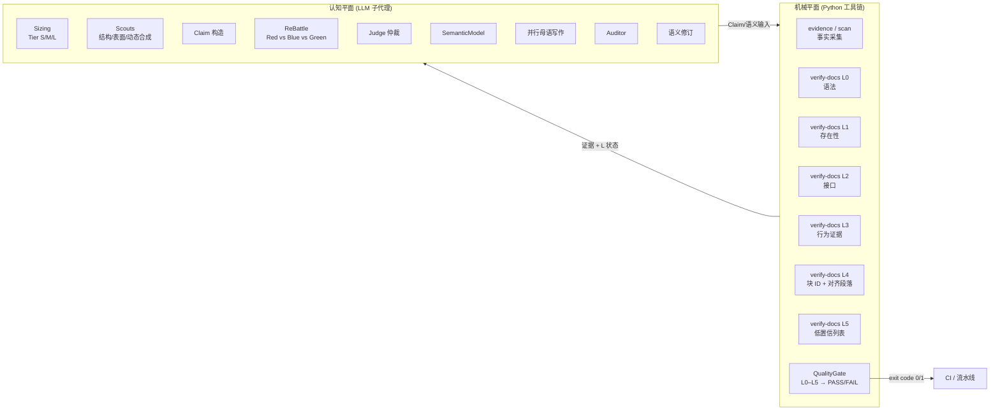

# MakeWiki.skills

<p align="center">
  <strong>面向 AI Coding Assistant 的 LLM-first、证据驱动、多智能体文档编译器</strong>
</p>

<p align="center">
  <a href="LICENSE"></a>
  <a href="pyproject.toml"></a>
  <a href="tests/"></a>
  <a href="skills/makewiki/"></a>
  <a href="references/grounding_policy.md"></a>
  <a href="skills/makewiki/"></a>
  <a href="makewiki/site/"></a>
  <a href="makewiki/export/"></a>
  <a href="makewiki/sync/"></a>
</p>

---

[English](README.en.md) | **简体中文**

---

MakeWiki 是一个开源的多智能体技能插件与 Python 工具包，专为 Claude Code、Codex 等 AI 编程助手设计。它采用 **LLM-first 架构**——由 LLM 子代理全权负责理解、推理与写作，由 Python 工具链完成确定性的证据提取与验证——为软件项目自动生成**证据驱动（evidence-backed）**的多语言 Markdown 技术文档，并一键编译为离线单页静态 Wiki、HTML 打印指南、EPUB 电子书与 Confluence / Notion 同步载荷。

> **Cognitive Authority Boundary**：LLM 决定仓库的含义，Python 只证明能被机械证明的东西；当无法证明时，Python 返回 `UNKNOWN`，绝不猜测。

---

## ⚡ 快速使用

### 1. 载入插件

```bash
claude --plugin-dir /path/to/MakeWiki.skills
```

### 2. 在对话中调用

```text
/makewiki --lang en --lang zh-CN
```

主代理会按 Sizing → Scout → ReBattle → Judge → Semantic Model → 并行写作 → 审计 → 语义修订 的**权威流程**调度 LLM 子代理，由 Python 工具链提供证据提取、L0–L5 验证与质量门禁；最终在 `<项目>/makewiki/` 输出结构化文档、静态站点、HTML/EPUB 导出包与同步数据。

---

## 🛠️ Skills 技能与 CLI 工具表面

CLI 表面按权威名 + 向后兼容别名设计，Python 部分严格只做机械证明，不参与认知生成。

| 类别                   | 权威命令                                     | 别名                  | 平面      | 角色                                                          |
| -------------------- | ---------------------------------------- | ------------------- | ------- | ----------------------------------------------------------- |
| 全流程 Skill            | `/makewiki`                              | —                   | 认知      | 完整流水线：Sizing → Scout → ReBattle → Writer → Review → Compile |
| 站点编译                 | `/makewiki-site`                         | —                   | 机械      | 将既有 Markdown 编译为离线静态 Wiki                                   |
| 文档质量门禁               | `/makewiki-validate`                     | —                   | 机械      | Markdown 结构与死链校验                                            |
| 文档质量复核               | `/makewiki-review`                       | `semantic-review`   | 机械      | 提取跨语言对齐段落 + 行为证据                                            |
| 项目测绘                 | `/makewiki-scan`                         | —                   | 认知 + 机械 | 评估规模与提取事实（调用 `evidence`）                                    |
| 配置生成                 | `/makewiki-init`                         | —                   | —       | 生成默认 `makewiki.config.yaml`                                 |
| Toolkit: 尺寸          | `makewiki sizing <path>`                 | —                   | 机械      | 评估 Tier S/M/L                                               |
| Toolkit: 证据          | `makewiki evidence <path>`               | `makewiki scan`     | 机械      | 输出事实 JSON（不解读）                                              |
| Toolkit: 验证          | `makewiki verify-docs <path>`            | `makewiki verify`   | 机械      | L0–L5 + QualityGate → PASS/FAIL + CI exit code              |
| Toolkit: 声明验证        | `makewiki verify-claim <claim.json>`     | —                   | 机械      | 单条/多条 Claim 的 L 状态                                          |
| Toolkit: 模型验证        | `makewiki verify-model <model.json>`     | —                   | 机械      | SemanticModel schema + 证据引用校验                               |
| Toolkit: 跨语言对比       | `makewiki parity <path>`                 | —                   | 机械      | 块 ID 完全相同 + 对齐段落输出                                          |
| Toolkit: ReBattle 差异 | `makewiki rebattle-diff`                 | —                   | 机械      | 争议点确定性组织                                                    |
| Toolkit: 站点          | `makewiki build-site <path>`             | —                   | 机械      | 编译离线静态站点                                                    |
| Toolkit: 导出          | `makewiki export <path> --format html\   | epub\               | all`    | —                                                           | 机械 | 单文件导出（拒绝 `pdf`） |
| Toolkit: 同步载荷        | `makewiki sync-bundle <path>`            | `makewiki sync`     | 机械      | 仅准备 Confluence/Notion 同步包，不发布                               |
| Toolkit: 确定性脚手架      | `makewiki deterministic-generate <path>` | `makewiki generate` | 机械      | **非权威路径**，仅用于回归测试                                           |
| Toolkit: 配置生成        | `makewiki init-config`                   | —                   | —       | 生成默认 `makewiki.config.yaml`                                 |

---

## 📁 文档与站点输出

默认生成在 `<项目>/makewiki/` 目录下：

```text
makewiki/
├── index.md                         # 目录索引与语言导航
├── README.md / README.zh-CN.md      # 项目总览
├── getting-started.md / ...         # 5 分钟上手教程 (Tutorial)
├── installation.md / ...            # 安装部署手册与兼容矩阵 (Runbook)
├── configuration.md / ...           # 配置与环境变量全量表 (Matrix)
├── usage/
│   ├── overview.md                  # 功能全景与模块依赖 (Explanation)
│   └── <module>.md                  # 场景化操作指南 (How-To)
├── faq.md / ...                     # 常见问题与已知限制（LLM 注入，缺失则标 UNKNOWN）
├── troubleshooting.md / ...         # 故障排查与应急指南 (Incident Runbook)
└── site/
    └── index.html                   # 离线单页静态 Wiki 网站（双击即可在浏览器中打开）
```

---

## 💡 双平面架构与权威边界

MakeWiki v2 显式划分为两个平面，并定义**认知权威边界**：



- **认知平面（Cognitive Plane）**：由 LLM 子代理承担所有理解、推理、对抗、写作与审计；可借助 Host Capability 选择并行 / 串行 / 主代理降级策略。
- **机械平面（Mechanical Plane）**：Python 工具链只做能机械证明的事情——事实提取、AST/CLI/配置解析、L0/L1/L2、L4 块 ID 完全相同比较、`UNKNOWN` 兜底、Quality Gate 汇总。
- **认知权威边界（Cognitive Authority Boundary）**：当 Python 无法机械证明时返回 `UNKNOWN`；绝不在 `faq`/`troubleshooting`/`usage_examples`/`user_tasks`/`platform_notes` 等认知字段中编造内容，这些字段只能由 LLM 注入。
- **Host Capability fallback**：当宿主不支持子代理时，主代理按顺序承担各角色；当不支持并行时降级为串行；不存在"没有子代理 API 就不能跑 MakeWiki"的情况。

---

## ✅ 接地策略：证据驱动 + 分层自动验证

MakeWiki 不再宣称"零幻觉"，而提供**可验证的证据驱动文档**：

- **L0 语法**：Markdown AST、单 H1、标题层级、内部链接有效性。
- **L1 存在性**：所有引用的文件路径、可执行命令、配置键在仓库中存在。
- **L2 接口**：CLI 参数名、标志、默认值、环境变量名、类型约束与源码声明一致。
- **L3 行为**：退出码、错误条件、日志位置、执行流可追溯到源码处理器（Python 提供行为证据，LLM 判定）。
- **L4 跨语言**：通过稳定块 ID（`getting_started.install` 等）做完全相同的机械比对 + 对齐段落输出供 LLM 散文审计。
- **L5 认识论**：所有低置信 / 未接地命令由 Python 列出，LLM 审计做最终判断。
- **Quality Gate**：单次 `verify-docs` 调用汇总 L0–L5 → `QualityGateResult`（PASS/FAIL + Grounding Score + 未解决关键问题计数），并返回 CI exit code。

`zero-hallucination` 不是工程承诺；**Grounding Score、未解决关键问题数、L0–L5 状态** 才是。详见 [`references/grounding_policy.md`](references/grounding_policy.md)。

---

## ⚙️ 配置文件 (`makewiki.config.yaml`)

如需自定义生成行为，可在项目根目录放置配置文件（可选）。配置字段分为两类：

- **LLM-consumed**：被 Skill 编排器 / 写作者读取（`agent.*`、`delivery.*`、`language_profiles.*`、`documentation_policy.*`）。
- **Python-consumed**：被机械平面读取（`site.include_search`、`scan.*`、`review.*`、`quality.*`、`revision.*` 等）。

```yaml
output_dir: makewiki
languages:
  - en
  - zh-CN
default_language: en
overwrite: true

agent:                       # LLM-consumed
  max_subagents: 10
  rebattle_rounds: 2
  tier_override: auto

site:                        # Python-consumed
  compile: true
  theme: auto
  include_search: true

delivery:                    # LLM-consumed
  audience: dual
  include_deployment_runbook: true
  include_compatibility_matrix: true

quality:                     # Quality Gate 阈值
  fail_on_critical: true
  min_grounding_score: 0.8
```

详细字段分类参见 `makewiki config schema` 与 `tests/contracts/test_config_consumption_contract.py`。

---

## 💻 本地开发与测试

MakeWiki.skills 基于 Python 3.11+ 构建，推荐使用 `uv` 管理开发环境：

```bash
# 克隆仓库并安装依赖
git clone https://github.com/somnifex/MakeWiki.skills.git
cd MakeWiki.skills
uv sync --all-extras

# 运行自动化测试套件（含 contract tests）
uv run pytest --basetemp=.pytest_temp

# 类型检查与代码格式化
uv run mypy src/makewiki_skills
uv run ruff check .
```

Toolkit 安装后会暴露 `makewiki` 控制台入口（`pip install` 后或 `uv run` 时可用）；`/makewiki` Skill 通过版本固定 + SHA256 校验的引导脚本拉取匹配的 Toolkit 版本，保证 Skill ↔ Toolkit 版本一致。

---

## 📄 开源协议

本项目采用 [MIT License](LICENSE) 协议开源。
